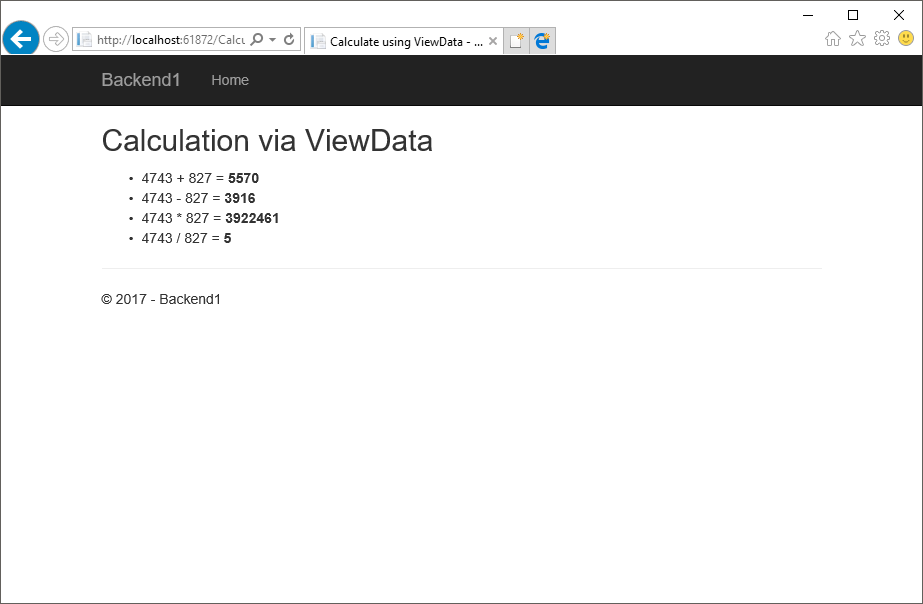

# Практика №1

## Темы

1. Структура проекта
2. Dependency Injection
3. Передача данных в представление

## Задачи

1. Ознакомиться с заготовленным проектом.
2. В заготовленном проекте:
   1. Определить, реализовать и зарегистрировать 2 службы:
      * Служба, генерирующая случайные целые числа в заданном диапазоне.
      * Служба, позволяющая выполнять основные арифметические операции над целыми числами (+, -, *, /).
   2. Реализовать контроллер, который будет использовать эти службы для того, чтобы
      * Сгенерировать 2 случайных числа
      * Произвести с этими числами все арифметические операции
      * Передать числа и результаты каждой операции в представление для отображения (всеми разобранными способами)
   3. Реализовать набор представлений для этого контроллера, которые выведут сгенерированные числа и результаты операций с ними.
   4. Из представления Home/Index сделать ссылки на дейсвия нового контроллера

## Результат



## Материалы

### Структура проекта

* Dependencies  
  Зависимости проекта. Ссылки на библиотеки, NuGet или Bower пакеты.
* Properties  
  Свойства проекта, а также, контейнер для файла launchSettings.json, в котором содержатся настройки запуска проекта в Visual Studio.
* wwwroot  
  Статичные файлы (*.css, *.js, изображения, и т.д.). Отдаются веб-сервером как есть.
* Controllers  
  Папка, предназначенная для классов контроллеров ASP.NET Core MVC
* Models  
  Папка, предназначенная для классов модели
* Services  
  Папка, предназначенная для служб
* Views  
  Папка, предназначенная для представлений ASP.NET Core MVC
* appsettings.json  
  Настройки проекта
* bower.json  
  Настройки пакетного менеджера Bower
* bundleconfig.json  
  Настройки объединения и минификации стилей и скриптов
* Program.cs  
  Класс, запускающий веб-приложение.
* Startup.cs  
  Класс, настраивающий запуск веб-приложения.

### Dependency Injection

#### Определение интерфейса службы

```csharp
public interface IDateTimeService
{
    DateTime Now { get; }
}
```

#### Реализация службы

Для реализации службы необходимо создать класс, реализующий определяющий ее интерфейс.

```csharp
public class DateTimeService : IDateTimeService
{
    public DateTime Now => DateTime.Now;
}
```

Примечание
```csharp
public DateTime Now => DateTime.Now
```
является сокращенным синтаксисом для определения реализации свойства с помощью выражение и эквивалентно
```csharp
public DateTime Now
{
    get
    {
        return DateTime.Now;
    }
}
```


#### Регистрация службы

Регистрация служб выполняется в методе `ConfigureServices` класса `Startup`:
```csharp
services.AddSingleton<IDateTimeService, DateTimeService>();
```
Кроме `AddSingleton` можно еще использовать методы `AddScoped` и `AddTransient` для регистрации службы с соответствующим временем жизни.

#### Подключение службы в контроллере

Для подключения службы в контроллере достаточно указать ее в качестве одного из аргументов ее конструктора:
```csharp
public class DateTimeController : Controller
{
    private readonly IDateTimeService dataTimeService;

    public DateTimeController(IDateTimeService dataTimeService)
    {
        this.dataTimeService = dataTimeService;
    }
}
```

#### Подключение службы в представлении

Для подключения службы в представлении необходимо использовать следующую конструкцию:
```
@inject IDateTimeService DateTimeService
```

### Передача данных в представление

#### ViewData

И контроллер и представление, которое будет им вызвано имеют доступ к общему словарю `ViewData` (`IDictionary<String, Object>`), через который можно выполнить передачу данных как между контроллером и представлением, так и между различными представлениями (в случае использования Layout-ов).

Установка значения:
```csharp
this.ViewData["Current"] = current;
```

Получение значения:
```
<dd>@ViewData["Current"]</dd>
```

#### ViewBag

`ViewBag` - динамический объект, хранящий свои данные в словаре `ViewData`

Установка значения:
```csharp
this.ViewBag.Current = current;
```

Получение значения:
```
<dd>@ViewBag.Current</dd>
```

#### Model

Помимо нетипизированных `ViewBag`/`ViewData`, можно определить строготипизированную модель в виде класса или интерфейса для конкретного представления и передавать соответствующий экземпляр из контроллера

Описание модели:
```csharp
public class DateTimeViewModel
{
    public DateTime Current { get; set; }
}
```

Создание экземпляра модели:
```csharp
var model = new DateTimeViewModel
{
    Current = current
};
```

Передача модели в представление:
```csharp
return this.View(model);
```

Описание используемой моделив представлении:
```
@model Backend1.Models.DateTimeViewModel
```

Получение данных из модели:
```
<dd>@Model.Current</dd>
```

#### Service Injection

Помимо вышеуказанных способов, представление может самостоятельно подключить нужную ему службу и запросить из нее данные.

Подключение службы:
```
@inject IDateTimeService DateTimeService
```

Получение данных:
```
<dd>@DateTimeService.Now</dd>
```